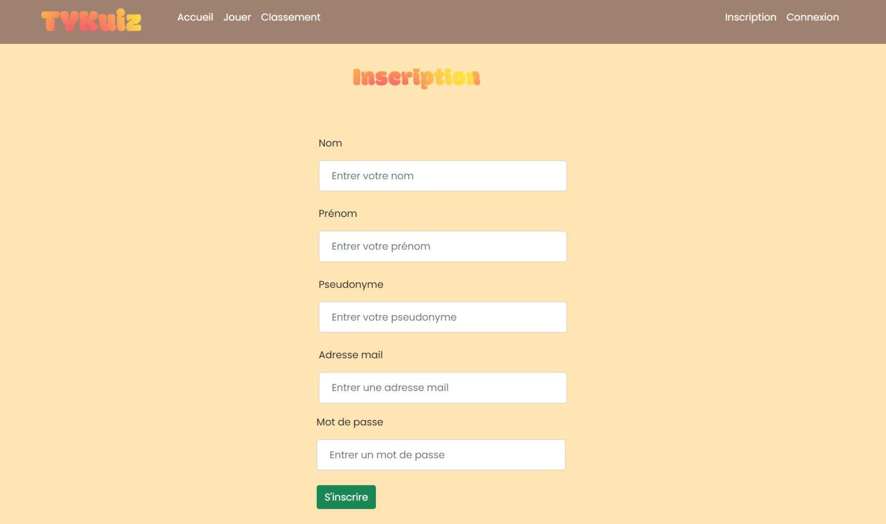

# TYKuiz

## 1. Présentation 

Le sujet porte sur la réalisation d’une application web de tests proposant des quiz dans le domaine de l’informatique aux utilisateurs en attribuant des points à chaque bonne réponse. L’utilisateur doit d’abord s’authentifier pour jouer ou bien créer un compte s’il ne détient pas encore.

Le projet a été dévéloppé avec les servlets **TOMCAT** en Java pour la partie Backend et **ReactJS** pour la partie Frontend.

## 2. Squelette du serveur 

Pour notre application web sur les quiz, nous nous basons sur une approche ressource (REST).
Dans cette approche, les requêtes et les réponses sont construites autour du transfert de représentation de ressources.

 

    
  
 

## 3. Les différentes vues du site web 

 

    
  
 

   

    
  
 
   

    
  
 
   

    
  
 